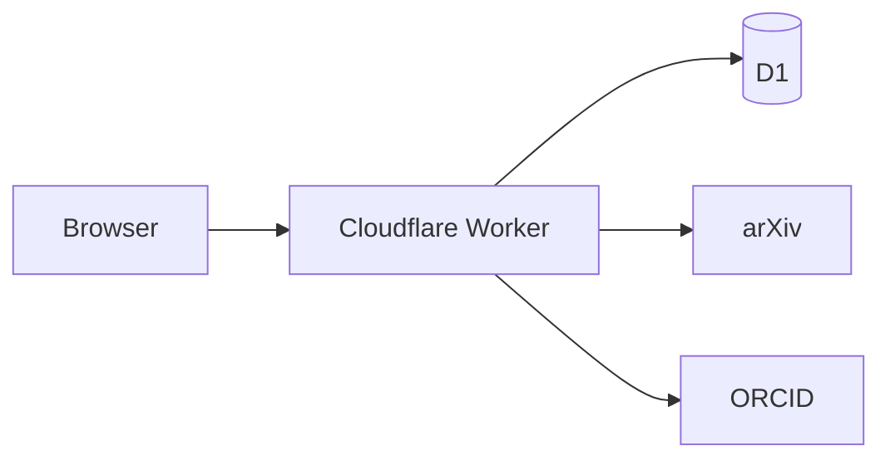

<p align="center">
  
</p>

<h1 align="center">binodal</h1>

<p align="center"><strong>A public record of scientific activity around papers.</strong></p>

<p align="center">
  <a href="https://binodal.llui2.workers.dev">binodal.llui2.workers.dev</a>
</p>

## About

binodal is open, researcher-first infrastructure for finding scientific work and interacting around it.

The paper remains the stable reference. binodal records what develops around it: discussion, clarification, connections, follow-up work, and the researchers engaging with it. The aim is a durable public scientific record rather than another feed, publisher workflow, or generic comment section.

The current beta is intentionally small. It starts with arXiv papers and ORCID identity so the basic interaction can be tested before imposing richer structures.

## Current beta

- Resolve an arXiv ID or URL into a binodal paper page.
- Fetch and cache paper metadata from arXiv.
- Read discussion without an account.
- Sign in with ORCID to contribute under a persistent scientific identity.
- Post threaded public comments.
- Navigate paper-level views for discussion, references, and related work.
- Store application data in Cloudflare D1.

References and related-paper indexing are not implemented yet.

## Principles

binodal is built for researchers rather than publishers, advertisers, or engagement metrics.

- **Researchers are the primary actors.** Papers provide a shared coordinate system for scientific interaction.
- **Scientific usefulness comes before engagement.** Ranking should help decide what deserves attention, not maximize time on site.
- **Participation should stay lightweight.** A useful contribution should not always require writing a post.
- **Algorithms should be inspectable.** Discovery and recommendation should be understandable and controllable where practical.
- **Public contributions should remain durable.** Prefer open identifiers, addressable records, exportable data, and minimal lock-in.
- **AI should reduce search and coordination costs.** It should reconnect researchers with papers and people rather than replace scientific interaction.

The longer product direction is documented in [`docs/PRODUCT_PRINCIPLES.md`](docs/PRODUCT_PRINCIPLES.md), with the current implementation sequence in [`docs/ROADMAP.md`](docs/ROADMAP.md).

## Architecture



| Component | Role |
| --- | --- |
| Cloudflare Workers | Application and HTTP layer |
| Cloudflare D1 | Papers, users, sessions, and discussion |
| arXiv | Canonical paper metadata and source links |
| ORCID OAuth | Persistent researcher identity |
| TypeScript | Application implementation |

The Worker serves both the HTML interface and the small JSON/API surface. Paper metadata is cached locally after the first lookup.

## Development

Requirements: Node.js and a Cloudflare account.

```bash
git clone https://github.com/llui2/binodal.git
cd binodal
npm install
```

Create a D1 database:

```bash
npx wrangler d1 create scholia
```

Add the returned database ID to `wrangler.toml`, then initialize the local database:

```bash
npm run db:migrate
```

Register an ORCID OAuth client and configure:

```bash
npx wrangler secret put ORCID_CLIENT_ID
npx wrangler secret put ORCID_CLIENT_SECRET
```

For local development, use `.dev.vars`:

```dotenv
ORCID_CLIENT_ID=...
ORCID_CLIENT_SECRET=...
ORCID_REDIRECT_URI=http://localhost:8787/auth/orcid/callback
```

Run locally:

```bash
npm run dev
```

Type-check:

```bash
npm run typecheck
```

Deploy:

```bash
npm run deploy
```

For production, `ORCID_REDIRECT_URI` can be configured explicitly or left unset to use `<origin>/auth/orcid/callback`.

## Routes

| Route | Purpose |
| --- | --- |
| `/` | Paper lookup |
| `/p/:arxivId` | Paper record and activity |
| `/auth/orcid` | Start ORCID authentication |
| `/auth/orcid/callback` | ORCID OAuth callback |
| `/logout` | End the current session |
| `/api/papers/:id` | Paper metadata |
| `/api/comments` | Create a comment |
| `/health` | Service health |

## Direction

The beta begins with discussion because it is the smallest useful public interaction around a paper. The larger model is:

**Discover → Understand → Interact**

Future work may include lightweight scientific signals, links to code and data, references and related-work structure, personalized literature prioritization, research sessions, researcher connections, transparent ranking, and agent-assisted literature monitoring.

These are directions rather than commitments. The product should remain small until real researcher behavior justifies additional structure.

## License

[MIT](LICENSE)
